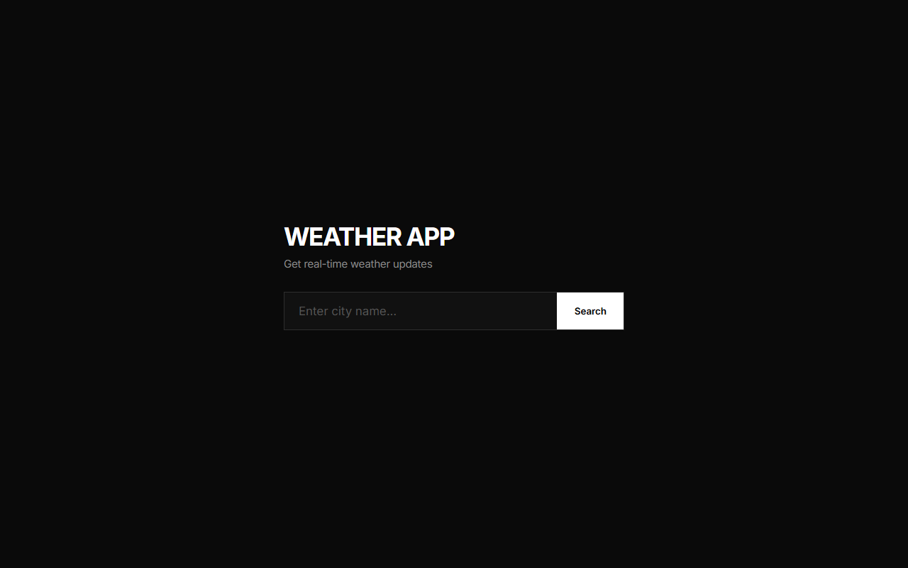

# Weather App

## Description
A clean, modern, and dynamic weather application that provides real-time weather updates based on city name. It uses the free Open-Meteo API to fetch both geocoding data and current weather conditions.

## Live Demo
[Live Demo Link](https://ayushkumar563.github.io/weather-app/) *(Deployed on GitHub Pages)*

## Tech Stack
- **HTML5**
- **CSS3** (Vanilla CSS with custom properties and animations)
- **JavaScript (ES6)** (Vanilla JS with Async/Await & Fetch API)
- **Open-Meteo API** (No API key required)

## How to Open / Run
Since this is a fully static project with no backend server dependencies:
1. Clone or download this repository.
2. Navigate to the `weather-app/` directory.
3. Simply double-click on `index.html` to open it in your default web browser.
4. (Optional) Deploy directly to static hosting platforms like GitHub Pages or Netlify.

## Deployment
This project is automatically deployed to GitHub Pages. Visit the [live demo](https://ayushkumar563.github.io/weather-app/) to see it in action.
